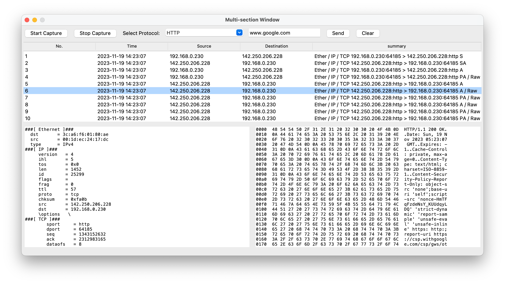

# TU-pypacket

한국공학대학교 컴퓨터 네트워크 설계 과제입니다.



파이썬을 이용해 특정 프로토콜을 실행, 수집, GUI로 시각화 해주는 프로그램입니다.

또한 Mermaid 언어를 사용하여 패킷의 흐름을 다이어그램로 시각화한 png를 생성합니다.


## Getting Started

### Prerequisites

Before you begin, ensure you have met the following requirements:

- You have installed [Python](https://www.python.org/downloads/).
- You have a Windows/Linux/Mac machine capable of running Python 3.x.
- You have installed [Node.js and npm](https://nodejs.org/), which includes `npm`.

### Installing

A step by step series of examples that tell you how to get a development env running.

First, clone the repository or download the source code into your local machine:

```
git clone https://github.com/POL6463/tu_pypacket.git
```

Navigate to the project directory:

```
cd path/to/your/tu_pypacket
```

Install the Python dependencies with pip:

```
pip install -r requirements.txt
```

If you are using a specific Python version or have multiple Python versions installed, you may need to specify pip version as follows:

```
pip3 install -r requirements.txt

$ brew install python-tk
```

To install Mermaid CLI for generating diagrams from Mermaid markdown files, use npm:

```
npm install -g @mermaid-js/mermaid-cli
```

The `-g` flag installs the Mermaid CLI globally so you can use it from any directory.

### Running the Application

```
python main.py
```

## Usage
